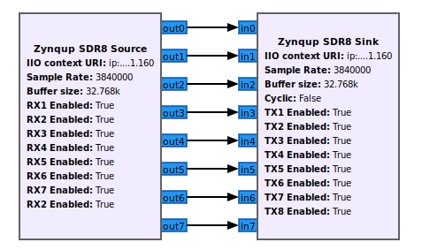
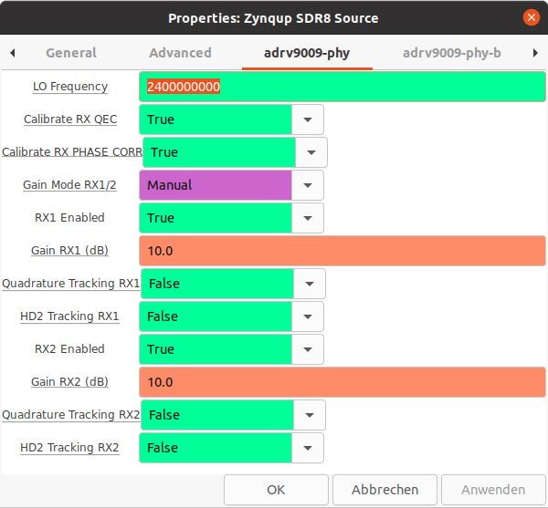
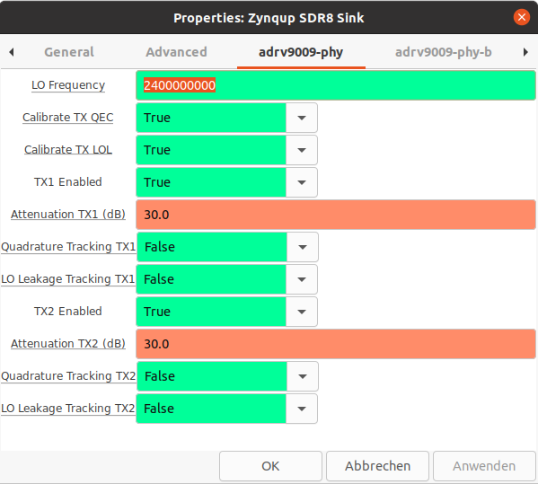

# N.A.T. GmbH IIO blocks for GNU Radio

gr-nat contains several new blocks for GNU Radio, that can be used to stream samples from and to N.A.T. GmbH devices. These new GNU Radio blocks are built around ADI’s libiio library, which concentrates most of the complexity and has built-in support for data streaming over the network. This data streaming feature has several benefits: it allows the GNURadio flowgraphs to run on operating systems other than Linux (including Windows) and on more powerful computers.

# Supported Tools and Releases

Tested with:
* GNU Radio 3.8 (only supported release)
* Ubuntu 20.04

# Linux Installation with .deb Package
Required packages:

```
cmake
debhelper (>= 12)
dh-python
doxygen
gnuradio-dev (>= 3.8)
libcppunit-dev
libgmp-dev
libiio-dev (>= 0.18)
liborc-0.4-dev
pkg-config
python3-dev
swig
```
Build & Install:

```
git clone https://github.com/NAT-GmbH/nat-amc-zynqup-sdr.git
cd nat-amc-zynqup-sdr/gr-nat
dpkg-buildpackage -us -uc
cd ..
sudo dpkg -i libgnuradio-nat1_0.1_amd64.deb gr-nat_0.1_amd64.deb
```

# Linux Installation with Compiling

gr-nat is like gr-iio based on libiio and shares the same installation routine.  
Therefore you can find additional information for the installation on https://wiki.analog.com/resources/tools-software/linux-software/gnuradio.

### Dependencies

gr-nat requires a few main dependencies:

* libiio
* GNU Radio and its development packages
* swig (For python support)

### GNU Radio 3.7

Not supported

### GNU Radio 3.8

If you did not install libiio from source you will need the following packages:

* cmake
* git
* libgmp-dev
* swig
* liborc-dev

```
(sudo) apt install cmake git libgmp-dev swig liborc-dev
```
Build and install gr-nat from source:
```
git clone https://github.com/NAT-GmbH/nat-amc-zynqup-sdr.git
cd nat-amc-zynqup-sdr/gr-nat
mkdir build && cd build
cmake ..
make
sudo make install
sudo ldconfig
```

### Post installation

Make sure the gr-nat swig interface is on your PYTHONPATH. Otherwise, you will get import errors in python.  
The common command would be (depending on OS and install location):


```
export PYTHONPATH=$PYTHONPATH:/usr/lib/python{PYTHON VERSION}/{site or dist}-packages
# For Ubuntu 20.04
export PYTHONPATH=$PYTHONPATH:/usr/local/lib/python3/dist-packages
```

You can see the path where the swig interface is installed on your computer during `sudo make install` .  
You can add this command to your `.bashrc` to execute it every time you open a bash shell.

You can install gr-nat swig into /usr to avoid adding it manually to PYTHONPATH by using:
```
cmake .. -DCMAKE_INSTALL_PREFIX=/usr/
```


# Windows support

Please look at the chapter "Windows Support" in the gr-iio [installation manual](https://wiki.analog.com/resources/tools-software/linux-software/gnuradio).

# Using the Zynqup SDR4/8 Blocks




Due to the high amount of configurations that needs to be written, it takes about 40s to startup a flowgraph with sink and source block.

The RX/TX channel 1 to 8 can be configured using the Zynqup SDR8 blocks (TX/RX 1 to 4 for the SDR4). Due to clarity reasons, only the configuration of the channel 1 and 2 is shown in the documentation below.

### Common


* **IIO context URI**: Set to “local:” if using GNU Radio locally on the target e.g. the SDR-Board in the non standalone version. If using GNU Radio remote on a PC, set the target IP address using ip:XXX.XXX.XXX.XXX
* **Buffer size**: Size of the internal buffer in samples. The IIO blocks will only input/output one buffer of samples at a time.
* **LO Frequency**:  Selects the RX/TX local oscillator frequency. Range 75 MHz to 6 GHz with 1 Hz tuning granularity. If you are using both the sink and source block in a flowgraph, you need to set the same lo frequency in both blocks, since RX and TX share the same local oscillator in an ADRV9009.
* **Sample Rate**: Frequency at which the hardware will input/output samples.


### Source Block




* **RX1/RX2 Enabled**: Enables the receive data path.
* **Calibrate RX QEC**: If enabled, RX QEC calibration is performed at startup.
* **Calibrate RX PHASE CORR**: If enabled, RX PHASE CORR calibration is performed at startup.
* **Gain Mode RX1/2**: Select the gain mode for the adrv9009. 'Slow Attack' to use the automatic gain control or 'Manual' to set the gain manually.
* **Gain RX1/RX2 [dB]**:  Controls the RX gain only in 'Manual' gain control mode. Range 0 dB to 30 dB with 0.5dB tuning granularity.
* **Quadrature Tracking RX1/RX2**: Enables RX Quadrature Tracking.
* **HD2 Tracking RX1/RX2**: Enables RX HD2 Tracking.

### Sink Block




* **TX1/TX2 Enabled**: Enables the transmit data path.
* **Calibrate TX QEC**: If enabled, TX QEC calibration is performed at startup.
* **Calibrate TX LOL**: If enabled, TX LOL calibration is performed at startup.
* **Attenuation TX1/TX2**:  Individually controlls attenuation for TX1 and TX2. The range is from 0 dB to 41.95 dB in 0.05dB steps.
* **Quadrature Tracking TX1/TX2**: Enables TX Quadrature Tracking.
* **LO Leakage Tracking TX1/TX2**: Enables TX LO Leakage Tracking.
* **Cyclic**: Set to “true” if the “cyclic” mode is desired. In this case, the first buffer of samples will be repeated on the enabled channels of the Zynqup Sink until the program is stopped.
The Zynqup Sink block will report its processing as complete: the blocks connected to the Zynqup Sink block won't execute anymore, but the rest of the flow graph will.


# Examples

Several sample flow graphs that use the Zynqup SDR 4/8 blocks are provided in our GNU Radio repository. They can be found in the “nat-example” folder.
